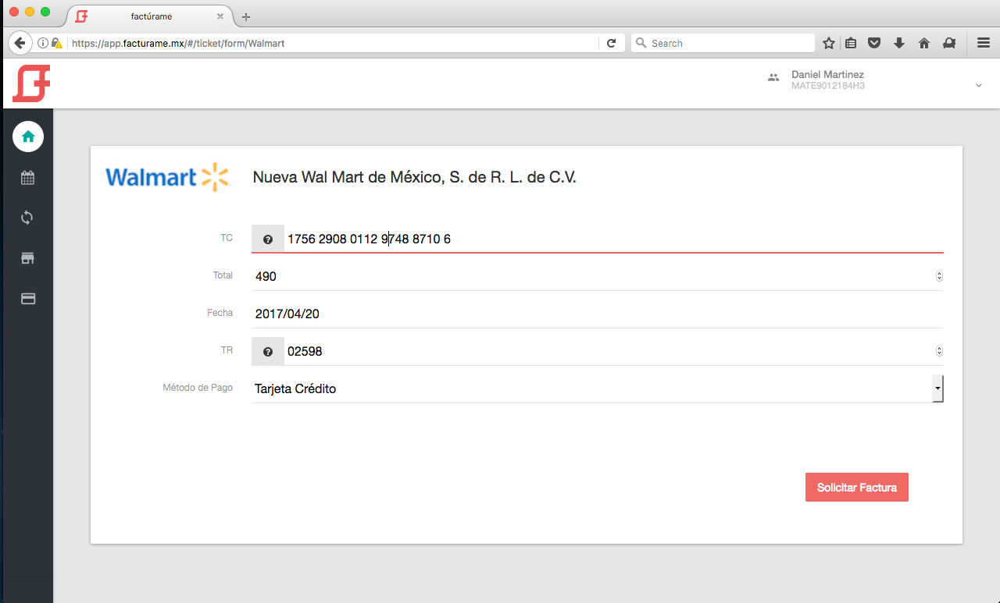

# Portal de Autofacturación

> Ejemplo del funcionamiento de un portal de autofacturación en **factúrame**

### Nota

A partir del 1 de junio del 2017 este documento estará centrado en la versión de **CFDI 3.3**, dada a conocer por el Servicio de Administración Tributaria (SAT) y que será de uso general y obligatorio a partir del 1 de diciembre de 2017.

La documentación archivada puede encontrarse a continuación.

- [Autofacturación con *CFDI 3.2*.](guides/CFDI_32.md)

## Índice

- [Provisión de cuenta](#provisi%C3%B3n-de-cuenta)
- [Formación de un documento](#formaci%C3%B3n-de-un-documento)
- [Alta y bloqueo de un documento](#alta-y-bloqueo-de-un-documento)
- [Solicitud de facturación](#solicitud-de-facturaci%C3%B3n)


## [Provisión de cuenta](id:provision_cuenta)

Para completar con éxito la provisión de la cuenta son requeridos los siguientes datos:

- RFC
- ID y Token de su proveedor de facturación
- Número de certificado
- Nombre de plantilla para generar PDF

Para usuarios de los siguientes proveedores, los datos pueden ser solicitados automáticamente por Factúrame:

- [Diverza](http://diverza.com)


## [Formación de un documento](id:formacion_documento)

Para la emisión de comprobantes fiscales es necesario que el emisor envíe la información necesaria para generar el comprobante, para lo cual se utiliza un archivo XML de tipo **Comprobante**.

**Factúrame**, a través de los servicios de un proveedor de facturación, se encargará de generar el CFDI con el sello correspondiente y la certificación del timbre cuando sea requerido.

El siguiente es un ejemplo de comprobante para emisión de CFDI de tipo ingreso.

```
<?xml version="1.0" encoding="utf-8" ?>
<cfdi:Comprobante xmlns:tdCFDI="http://www.sat.gob.mx/sitio_internet/cfd/tipoDatos/tdCFDI" xmlns:cfdi="http://www.sat.gob.mx/cfd/3" xsi:schemaLocation="http://www.sat.gob.mx/cfd/3 http://www.sat.gob.mx/sitio_internet/cfd/3/cfdv33.xsd" xmlns:xsi="http://www.w3.org/2001/XMLSchema-instance" xmlns:tfd="http://www.sat.gob.mx/TimbreFiscalDigital" LugarExpedicion="06300" Moneda="MXN" Certificado="" Descuento="0.00" Fecha="2017-05-02T10:15:49" Folio="4119" FormaPago="01" MetodoPago="PUE" NoCertificado="20001000000200001428" Sello="" Serie="B" SubTotal="616.37" TipoDeComprobante="I" Total="715.00" Version="3.3">
    <cfdi:Emisor Nombre="Empresa TEST Emisor SA de CV" Rfc="AAA010101AAA" RegimenFiscal="601"/>
    <cfdi:Receptor Nombre="Empresa TEST Receptor SA de CV" Rfc="XAXX010101000" UsoCFDI="G03"/>
    <cfdi:Conceptos>
        <cfdi:Concepto ClaveProdServ="01010101" Cantidad="1" Descripcion="Articulo Test 001" Importe="616.37" ClaveUnidad="E48" Unidad="Servicio" ValorUnitario="616.37">
            <cfdi:Impuestos>
                <cfdi:Traslados>
                    <cfdi:Traslado Base="616.37" TipoFactor="Tasa" TasaOCuota="0.160000" Impuesto="002" Importe="98.62"/>
                </cfdi:Traslados>
            </cfdi:Impuestos>
        <cfdi:Parte ClaveProdServ="01010101" NoIdentificacion="COD05" Cantidad="1.00" Unidad="Pieza" Descripcion="Parte 1" ValorUnitario="100.00" Importe="100.00">
        <cfdi:InformacionAduanera NumeroPedimento="17  01  3173  7123456"/>
      </cfdi:Parte>
        </cfdi:Concepto>
    </cfdi:Conceptos>
    <cfdi:Impuestos TotalImpuestosTrasladados="98.62">
        <cfdi:Traslados>
            <cfdi:Traslado Importe="98.62" Impuesto="002" TipoFactor="Tasa" TasaOCuota="0.160000"/>
        </cfdi:Traslados>
    </cfdi:Impuestos>
</cfdi:Comprobante>
```

---

[Descarga el esquema XSD](http://www.sat.gob.mx/informacion_fiscal/factura_electronica/Paginas/Anexo_20_version3.3.aspx) que puedes usar para validar la estructura del XML.


## [Alta y bloqueo de un documento](id:alta_documento)

Una vez construido el documento, y luego de haber recibido un **web token** por parte del equio de **factúrame**, el alta del documento se realiza enviando una petición HTTPS con el archivo codificado en Base64 y posteriormente como valor en un objeto JSON.

A continuación se describen los parámetros requeridos en la petición.

Parámetro           | Descripción
:------------------ | :-----------
ref_id              | Para control interno del contribuyente. Acepta un valor alfanumérico. Debe ser único. Se recomienda el uso de una función de UUID.
document            | Es la representación codificada en Base64 del archivo xml de tipo **Comprobante**

### Ejemplos de código

A continuación encontrarás ejemplos básicos de cómo realizar una petición de alta en diferentes lenguajes de programación.


- [C#](examples/v33/csharp/post.cs)
- [Go](examples/v33/go/post.go)
- [Java](examples/v33/java/post.java)
- [Javascript](examples/v33/javascript/post.js)
- [Node.js](examples/v33/node/post.js)
- [PHP](examples/v33/php/post.php)
- [Python](examples/v33/python/post.py)
- [Ruby](examples/v33/ruby/post.rb)
- [Shell (curl)](examples/v33/shell/post.sh)


### Códigos de respuesta

La siguiente lista comprende todos los posibles códigos de respuesta del servicio de alta y sus posibles soluciones:

###### Códigos 200

**201** - Operación exitosa. El documento fue creado con éxito.

    {
      "ref_id":"57b6e71b-0ccf-46a3-88ab-9fcd799164c1",
      "ticket_number":"mRrrMjrsIQA0GtAft04vpQ",
      "processed":false,
      "is_available":true,
      "created_at":"2017-06-01T21:12:12.619Z"
    }


###### Códigos 400

**401** - No fue posible autenticar la petición.

**422** - La petición no pudo ser procesada exitosamente. Se incluye una respuesta indicando el parámetro y las causas que impidieron una respuesta exitosa.

Ejemplo: el documento no es válido.

    {
      "document_path":["can't be blank"]
    }

---    

Ejemplo: el RFC del documento no corresponde a la autenticación.

    {
	    "document": ["attribute Rfc on Emisor node does not match"]
    }

---

Para determinados casos se provee también la posibilidad de **bloquear y desbloquear** la solicitud de facturación del receptor de un documento ya emitido. Los parámetros requeridos para el consumo de este servicio son:

- *Web token*, para la autenticación de la petición.
- El *ticket_number* que fue generado a partir de un documento. El bloqueo o desbloqueo se hará sobre el documento al que se haga referencia en este parámetro.
- *is_available*, un valor de tipo booleano que indica si el documento puede estar o no disponible para su facturación.

### Ejemplos de código

A continuación encontrarás ejemplos básicos de cómo realizar una petición para actualizar la disponibilidad de un documento en diferentes lenguajes de programación.


- [C#](examples/v33/csharp/put.cs)
- [Go](examples/v33/go/put.go)
- [Java](examples/v33/java/put.java)
- [Javascript](examples/v33/javascript/put.js)
- [Node.js](examples/v33/node/put.js)
- [PHP](examples/v33/php/put.php)
- [Python](examples/v33/python/put.py)
- [Ruby](examples/v33/ruby/put.rb)
- [Shell (curl)](examples/v33/shell/put.sh)


### Códigos de respuesta

La siguiente lista comprende todos los posibles códigos de respuesta del servicio de bloqueo y sus posibles soluciones:

###### Códigos 200

**204** - Operación exitosa. La disponibilidad de la remisión fue actualizada con éxito.

###### Códigos 400

**401** - No fue posible autenticar la petición.

**422** - La petición no pudo ser procesada exitosamente.

Ejemplo: no se encontró el documento.

    {
	    "message": "The resource cannot be found"
    }

---    


## [Solicitud de facturación](id:solicitud_facturacion)

Una vez registrada la venta, el receptor podrá solicitar la facturación de su ticket a partir del número de ticket que le haya sido entregado.

Este paso requiere solamente la captura por parte del receptor del folio único de ticket.

A continuación se muestra una representación de esta acción.




## Licencia

MIT © Keemo Negocios por Tecnología SAPI de CV
