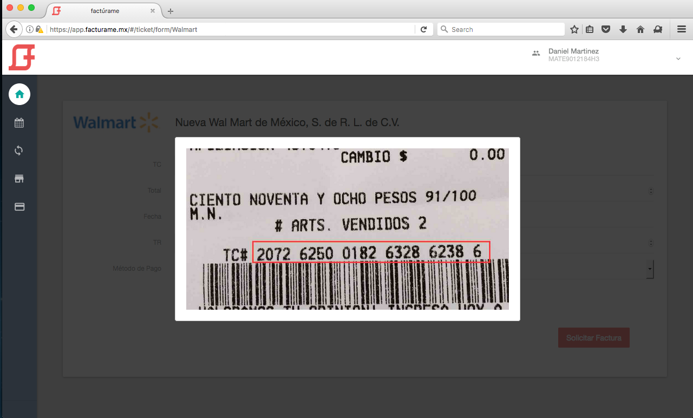

# Portal de Autofacturación

> Ejemplo del funcionamiento de un portal de autofacturación en **factúrame**

## Índice

- [Provisión de cuenta](#provision_cuenta)
- [Formación de una remisión](#formacion_remision)
- [Alta de una remisión](#alta_remision)
- [Alta de un ticket](#alta_ticket)


## [Provisión de cuenta](id:provision_cuenta)

Para completar con éxito la provisión de la cuenta son requeridos los siguientes datos:

- RFC
- ID y Token de su proveedor de facturación
- Número de certificado
- Nombre de plantilla para generar PDF

Para usuarios de los siguientes proveedores, los datos pueden ser solicitados automáticamente por Factúrame:

- [Diverza](http://diverza.com)


## [Formación de una remisión](id:formacion_remision)

Para la emisión de comprobantes fiscales es necesario que el emisor envíe la información mínima necesaria para generar el comprobante, para lo cual se utiliza un archivo XML de tipo **Remisión**.

La remisión incluye información propia de la emisión, como Emisor, Conceptos, Fecha de Emisión, etc. Se recomienda su uso para evitar la complejidad de construir, validar y firmar un CFDI directamente.

**Factúrame**, a través de los servicios de un proveedor de facturación, se encargará de generar el CFDI con el sello correspondiente y la certificación del timbre.

El siguiente es un ejemplo de remisión para emisión de CFDI de tipo ingreso en el que se destaca la ausencia de información sobre el Receptor, esta información será completada una vez que el consumidor decida solicitar la factura a partir de la información del ticket.

```
<?xml version="1.0" encoding="UTF-8"?>
<Remision xmlns:xsi="http://www.w3.org/2001/XMLSchema-instance" version="5.2">
  <InfoBasica rfcEmisor="AAA010101AAA" serie="FA" folio="12345">
   </InfoBasica>
  <InfoAdicional formaDePago="Pago en una sola exhibicion" total="15959.28" subTotal="13758.20" metodoDePago="02" numCtaPago="1234" tipoDeComprobante="ingreso" lugarExpedicion="123 Cacao Street
, Santa Fe, Distrito Federal"/>
  <Emisor nombre="Emisor Demo">
    <RegimenFiscal Regimen="Regimen General de Ley Personas Morales"/>
  </Emisor>
  <DomicilioFiscal codigoPostal="01210" pais="Mexico" estado="Distrito Federal" municipio="Alvaro Obregón" calle="Prolongación Paseo de la Reforma" noExterior="No. 600" noInterior="Piso 1 local 132"/>
  <Conceptos>
    <Concepto importe="1000.00" valorUnitario="11759.20" descripcion="iPhone 8 Plus" noIdentificacion="12345657" unidad="Pieza" cantidad="1.000">
    </Concepto>
    <Concepto importe="2999.00" valorUnitario="1999.00" descripcion="Mantenimiento" noIdentificacion="7654321" unidad="Servicio" cantidad="1.000">
       </Concepto>
  </Conceptos>
  <Impuestos totalImpuestosTrasladados="2201.31">
    <Traslados>
      <Traslado importe="2201.31" tasa="16.00" impuesto="IVA"/>
    </Traslados>
  </Impuestos>
</Remision>

```

---

[Descarga el esquema XSD](assets/xsd/remision_52.xsd) que puedes usar para validar la estructura del XML.


## [Alta de una remisión](id:alta_remision)

Una vez construida la remisión, y luego de haber recibido un **web token** por parte del equio de **factúrame**, el alta de la remisión se realiza enviando una petición HTTPS con la remisión codificada en Base64 y algunos datos adicionales.

A continuación se describen los parámetros requeridos en la petición.

Parámetro           | Descripción
:------------------ | :-----------
ref_id              | Para control interno del contribuyente, acepta un valor alfanumérico. Debe ser único. Se recomienda el uso de una función de UUID.
ticket_number       | Expresa el número de ticket con el cual el usuario receptor de la factura se referirá a la transacción, incluyendo la búsqueda y el procesamiento del ticket.
certificate_number  | Sobreescribe el valor proporcionado en la provisión de la cuenta en caso de necesitarlo. 
document            | Es la representación codificada en Base64 del archivo xml de tipo **Remisión**

### Ejemplos de código

A continuación encontrarás ejemplos básicos de cómo realizar una petición de alta de remisión en diferentes lenguajes de programación.


- [C#](examples/csharp/main.cs)
- [Go](examples/go/main.go)
- [Java](examples/java/main.java)
- [Javascript](examples/javascript/main.js)
- [Node.js](examples/node/main.js)
- [PHP](examples/php/main.php)
- [Python](examples/python/main.py)
- [Ruby](examples/ruby/main.rb)
- [Shell (curl)](examples/shell/main.sh)


### Códigos de respuesta

La siguiente lista comprende todos los posibles códigos de respuesta del servicio de timbrado y sus posibles soluciones:

###### Códigos 200

**201** - Operación exitosa. La remisión fue creada con éxito.

    {
      "ref_id":"007654KL32F8427129GRC3",
      "ticket_number":"99334194842183873900127",
      "created_at":"2017-04-03T18:20:13.240Z",
      "updated_at":"2017-04-03T18:20:13.240Z"
    }


###### Códigos 400

**401** - No fue posible autenticar la petición.

**422** - La petición no pudo ser procesada exitosamente. Se incluye una respuesta indicando el parámetro y las causas que impidieron una respuesta exitosa.

Ejemplo: el documento no es válido.

    {
      "document_path":["can't be blank"]
    }

---    

Ejemplo: el número de ticket es repetido.

    {
	  "ticket_number": ["has already been taken"]
    }


## [Alta de un ticket](id:alta_ticket)

Una vez registrada la remisión, el usuario receptor podrá solicitar la facturación de su ticket a partir del número de ticket que le haya sido entregado en el momento de la venta.

Este paso requiere solamente de la captura por parte del usuario receptor de los datos propios de un ticket, como el número de ticket, fecha, monto, sucursal, etc.

A continuación se muestra una representación de esta acción.




## Licencia

MIT © Keemo Negocios por Tecnología SAPI de CV
